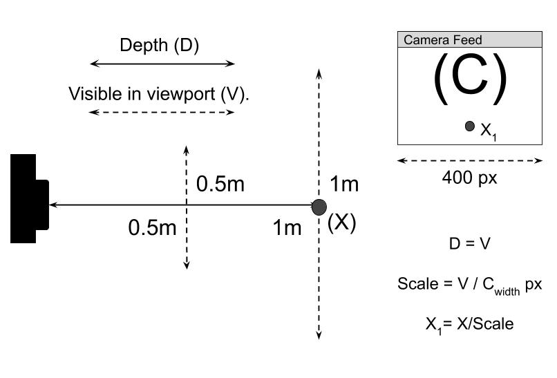

# Image Recognition with Distance data


## About
This program is a proof of concept application for 
use with the RadarIQ mmRadar module. The app 
demonstrates how the module may be utilized 
in conjunction with a camera to identify objects
and calculate their distance from the camera.

To run the application, with the RadarIQ
module connected to your computer, enter
```python image_recognition.py``` into the terminal at 
the application root directory. Note 
it may take a while to load. The radar device
only recognizes moving objects, so... "throw
your arms in the air and shake like you
just don't care." Actually, any kind of movement
should accelerate the process.

The app has been roughly calibrated for use with the
built-in camera of a specific Laptop, and the
resolution is 1280 x 720 pixels. This may work for your
setup, but modifications may be necessary.
See the diagram below for an explanation of our 
"calibration." Modify the method 
```adjust_x_pos(self, objects)``` in the 
ModImageDetectionDepth.py file under visualizations
with your own calibration calculations.



## Requirements
- numpy 1.19 +
- [RadarIQ Python SDK](#)
- opencv_python 4.4.0.42 +
- imutils 0.5.3 +
- matplotlib 3.3.1 +
- setuptools 50.3.0 +
- six 1.15.0 +

Installation:
-------------
1. Create a virtual env for this project

``python -m venv venv``

2. Activate the virtual env

* Windows: ``venv\scripts\activate``
* Linux: ``source venv/bin/activate``

3. Install requirements
   ``pip install -r requirements.txt``

OR:

Simply click on the "install" batch file, and it will install
   all the files required.

## License
Copyright 2021 RadarIQ, Ltd

Permission is hereby granted, free of charge, to 
any person obtaining a copy of this software and 
associated documentation files (the "Software"), 
to deal in the Software without restriction, 
including without limitation the rights to use, 
copy, modify, merge, publish, distribute, 
sublicense, and/or sell copies of the Software, 
and to permit persons to whom the Software is 
furnished to do so, subject to the following 
conditions:

The above copyright notice and this permission notice 
shall be included in all copies or substantial 
portions of the Software.

THE SOFTWARE IS PROVIDED "AS IS", WITHOUT WARRANTY OF 
ANY KIND, EXPRESS OR IMPLIED, INCLUDING BUT NOT LIMITED 
TO THE WARRANTIES OF MERCHANTABILITY, FITNESS FOR A 
PARTICULAR PURPOSE AND NONINFRINGEMENT. IN NO EVENT 
SHALL THE AUTHORS OR COPYRIGHT HOLDERS BE LIABLE FOR 
ANY CLAIM, DAMAGES OR OTHER LIABILITY, WHETHER IN AN 
ACTION OF CONTRACT, TORT OR OTHERWISE, ARISING FROM, 
OUT OF OR IN CONNECTION WITH THE SOFTWARE OR THE USE 
OR OTHER DEALINGS IN THE SOFTWARE.

