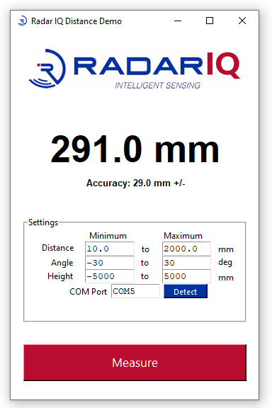
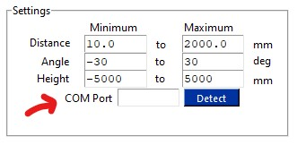
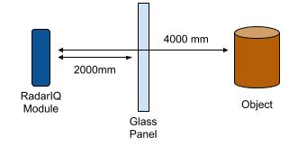

# Approximate Distance Measurement

This program is a measurement application for 
use with the RadarIQ mmRadar module. The app 
demonstrates how the module may be utilized 
to take approximate distance measurements of an 
object within 10 meters.

.

Note: Very accurate distance measurement is possible
using different firmware, running specialist algorithms.
This application is only for approixiamte mesurement using
the Point Cloud data.

With the module connected to the computer
via USB run ``` python distance_measurement.py ``` 
on the command line. Manually enter the
name of the COM port the for the device in 
the settings section or choose the detect option 
besides the field to let the program discover the 
device. Pressing the "Measure" button will return the
distance to the first object in range.



The capture parameters of distance, angle, and
height can be adjusted to optimize the measurement.
These are filters. Any readings from outside 
the specified range will be ignored when 
calculating distance. Consider the following example:


 
In the pictured example, an approximate measurement is
taken between the sensor and the object behind 
the glass. The minimum distance is set 2050 mm and
maximum to 5000mm. A measurement reading will now 
ignore the glass, and the application will return
the distance to the next detected object in range.


Installation:
-------------
1. Create a virtual env for this project

``python -m venv venv``

2. Activate the virtual env

* Windows: ``venv\scripts\activate``
* Linux: ``source venv/bin/activate``

3. Install requirements
   ``pip install -r requirements.txt``

OR:

Simply click on the "install" batch file, and it will install
   all the files required.

## License
Copyright 2021 RadarIQ, Ltd

Permission is hereby granted, free of charge, to 
any person obtaining a copy of this software and 
associated documentation files (the "Software"), 
to deal in the Software without restriction, 
including without limitation the rights to use, 
copy, modify, merge, publish, distribute, 
sublicense, and/or sell copies of the Software, 
and to permit persons to whom the Software is 
furnished to do so, subject to the following 
conditions:

The above copyright notice and this permission notice 
shall be included in all copies or substantial 
portions of the Software.

THE SOFTWARE IS PROVIDED "AS IS", WITHOUT WARRANTY OF 
ANY KIND, EXPRESS OR IMPLIED, INCLUDING BUT NOT LIMITED 
TO THE WARRANTIES OF MERCHANTABILITY, FITNESS FOR A 
PARTICULAR PURPOSE AND NONINFRINGEMENT. IN NO EVENT 
SHALL THE AUTHORS OR COPYRIGHT HOLDERS BE LIABLE FOR 
ANY CLAIM, DAMAGES OR OTHER LIABILITY, WHETHER IN AN 
ACTION OF CONTRACT, TORT OR OTHERWISE, ARISING FROM, 
OUT OF OR IN CONNECTION WITH THE SOFTWARE OR THE USE 
OR OTHER DEALINGS IN THE SOFTWARE.

