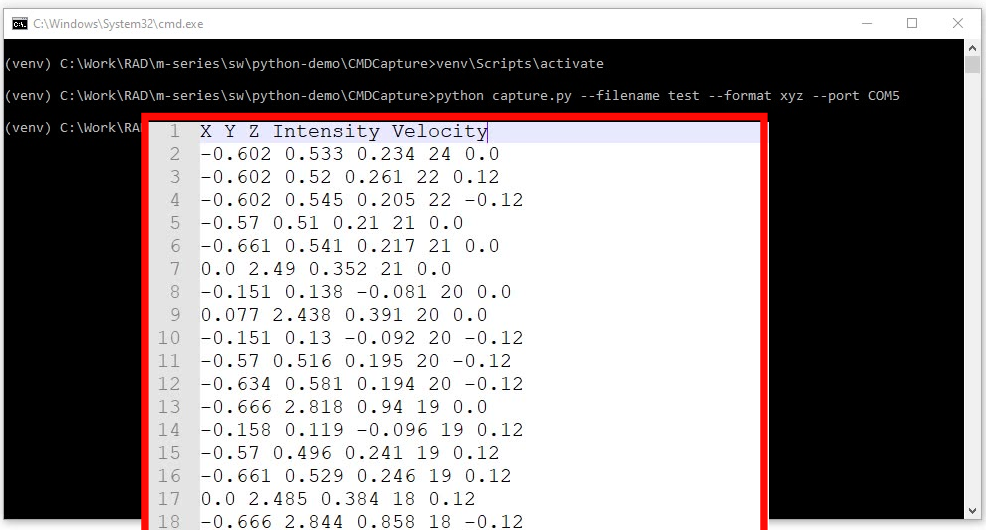
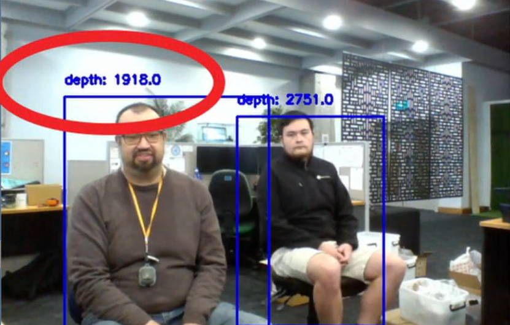
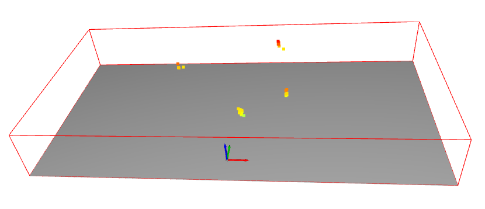
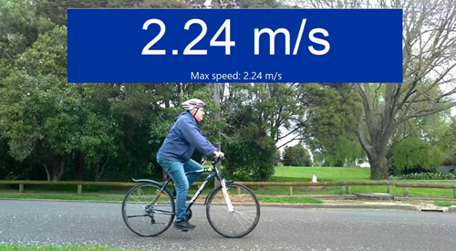
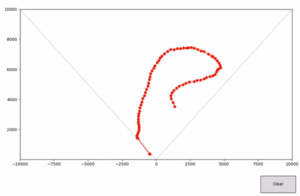
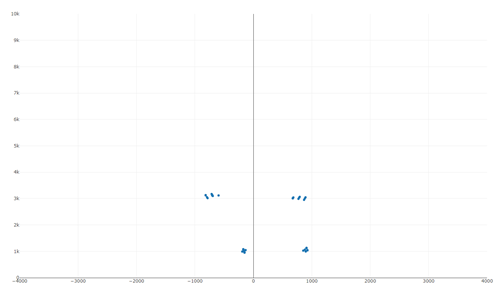

# Python Demo

This repository contains a series of demo applications for
the RadarIQ sensor which are written in Python.

These applications are designed to use the PointCloud or ObjectTracking modes.

## CMD Capture
This application allows for the capture of Point Cloud radar data into point cloud formats which can be 
opened with 3rd party point cloud visualisation software.

.

## Image recognition
Shows a RadarIQ plot beside a camera view, with the camera view running image classification
 

## Measurement
Roughly measure the distance to objects

.

## Open 3D
Visualise Point Cloud data using Open3D

.

## People counting
Count the number of people who walk past the sensor

## Speed plot

## Speed demo
This sample application records the speed in the X direction
of the first detected object from the RadarIQ sensor

.

## Surveillance System

## Tracing
Trace out the path of an object

.

## WebAPI
Pass RadarIQ Point Cloud data through a web API (eg for use in remote monitoring)

.
